<div align="center">

<!-- ═══════════════════════════════════════ -->
<!--          HEADER BANNER                  -->
<!-- ═══════════════════════════════════════ -->


<br/>

<!-- ═══════════════════════════════════════ -->
<!--          TYPING ANIMATION               -->
<!-- ═══════════════════════════════════════ -->

<a href="https://github.com/siriusforex-ai/mt5_forex_dashboard">
  
</a>

<br/><br/>

<!-- ═══════════════════════════════════════ -->
<!--          STATS + BADGES                 -->
<!-- ═══════════════════════════════════════ -->

<p>
  
  
  
  
</p>

<p>
  
  
  
  
  
</p>

<br/>

<!-- ═══════════════════════════════════════ -->
<!--          SOCIAL LINKS WITH HOVER        -->
<!-- ═══════════════════════════════════════ -->

<a href="https://www.youtube.com/@codepipss" target="_blank">
  
</a>
<a href="https://t.me/codepipss" target="_blank">
  
</a>
<a href="https://t.me/+qH90fZfIYeNmYzM1" target="_blank">
  
</a>
<a href="https://x.com/codepips_" target="_blank">
  
</a>

<br/><br/>

<a href="https://youtu.be/A6R89haIpg4">
  
</a>

<br/><br/>

</div>

---

## ⚡ Overview

A **fully live, real-time MT5 analytics dashboard** that pulls your account data straight from your broker and displays it on a clean cyberpunk-themed web interface. Built entirely with [Claude Code](https://claude.com/claude-code) inside Visual Studio Code — zero lines of code written by hand.

The dashboard refreshes every second via WebSocket, giving you a smoother, deeper view of your trading than the default MT5 terminal could ever offer.

```mermaid
flowchart LR
    A[🏦 MT5 Broker] -->|MetaTrader5 Library| B[🐍 Python Backend]
    B -->|FastAPI| C[⚡ WebSocket Server]
    C -->|JSON every 1s| D[🌐 Web Frontend]
    D -->|Chart.js + JS| E[🎨 Live Dashboard]

    style A fill:#05060D,stroke:#00D9FF,color:#00D9FF
    style B fill:#05060D,stroke:#FFE94D,color:#FFE94D
    style C fill:#05060D,stroke:#FF00C8,color:#FF00C8
    style D fill:#05060D,stroke:#00D9FF,color:#00D9FF
    style E fill:#05060D,stroke:#00FF87,color:#00FF87
```

<br/>

<div align="center">



</div>

---

## 🎯 Features

<table>
<tr>
<td width="50%" valign="top">

### 💎 Live Account Stats
- Balance, equity, today's P&L, open P&L
- Margin used, free margin, leverage
- Live status indicator
- Account number + broker server

### 📈 Equity Curve
- Last 90 days plotted with Chart.js
- Smooth cyan line with gradient fill
- Real-time updates as trades close
- Hover tooltip with full equity value

### 📋 Open Positions
- All active positions in a live table
- BUY / SELL color-coded badges
- Symbol, side, volume, entry, current, P&L
- Profit and loss glow in green / red

</td>
<td width="50%" valign="top">

### 📊 Trading Statistics
- Total trades, win rate, profit factor
- Avg win, avg loss, largest win, largest loss
- Max win streak, max loss streak
- Average hold time, most traded symbol

### 🔥 Pro Analytics
- Drawdown tracker with safe / caution / danger
- Per-symbol breakdown table
- Hourly P&L heatmap *(24 cells, UTC)*
- Weekday breakdown *(Mon–Sun)*

### ⚡ Live Tick Prices
- Configurable watched symbols
- Real-time bid / ask / spread
- Updates every second via WebSocket

</td>
</tr>
</table>

---

## 🛠 Tech Stack

<div align="center">

| Layer | Technology |
|:-----:|:----------:|
| **Backend** |    |
| **Data** |   |
| **Frontend** |     |
| **Built With** |   |

</div>

---

## 🚀 Quick Start

### 📋 Prerequisites

| Requirement | Notes |
|:-----------:|:------|
| 🪟 **Windows OS** | MT5 Python library is Windows-only |
| 🐍 **Python 3.10+** | [Download Python](https://www.python.org/downloads/) |
| 📊 **MetaTrader 5** | Installed + logged into your broker |
| 🔑 **MT5 Credentials** | Account number, password, server name |

> 💡 **Don't know how to set this up?** Watch [this video](https://youtu.be/A6R89haIpg4) where I walk through everything step by step.

### ⚡ Installation

```bash
# 1️⃣ Clone the repository
git clone https://github.com/siriusforex-ai/mt5_forex_dashboard.git
cd mt5_forex_dashboard

# 2️⃣ Install dependencies
pip install -r requirements.txt

# 3️⃣ Add your MT5 credentials to config.py
#    (account number, password, server)

# 4️⃣ Run the dashboard
python main.py
```

### 🌐 Open the Dashboard

Once the server is running, open your browser and navigate to:

```
http://localhost:8000
```

The dashboard will connect automatically and start streaming your live MT5 data.

---

## ⚙️ Configuration

Edit `config.py` to customize your dashboard:

```python
# ============================================================
# MT5 LOGIN
# ============================================================
MT5_LOGIN    = 12345678                # Your account number
MT5_PASSWORD = "your_password"         # Your account password
MT5_SERVER   = "YourBroker-MT5"        # Your broker server

# ============================================================
# DASHBOARD SETTINGS
# ============================================================
HOST = "127.0.0.1"
PORT = 8000
REFRESH_RATE_SECONDS = 1               # WebSocket push interval
HISTORY_DAYS_BACK    = 90              # Trade history range

# ============================================================
# WATCHED SYMBOLS (Live Tick Prices)
# ============================================================
WATCHED_SYMBOLS = ["GOLD", "EURUSD", "GBPUSD", "USDJPY"]
```

---

## 📁 Project Structure

```
mt5_forex_dashboard/
│
├── 📄 config.py              # MT5 credentials + settings
├── 📄 mt5_client.py          # MT5 connection + data fetching
├── 📄 analytics.py           # Trading stats + analytics engine
├── 📄 main.py                # FastAPI app + WebSocket server
├── 📄 requirements.txt       # Python dependencies
│
├── 📁 static/
│   ├── 🌐 index.html         # Dashboard layout
│   ├── 🎨 style.css          # Cyberpunk theme + glow effects
│   └── ⚡ app.js             # WebSocket client + render logic
│
├── 📖 README.md              # You are here
└── 📜 LICENSE                # MIT License
```

---

## 🎨 Design Philosophy

This dashboard is intentionally styled to feel like a high-end forex trading terminal. The cyberpunk aesthetic isn't just for looks — it's designed for **long trading sessions in low light**, where the dark navy background and neon accents reduce eye fatigue while keeping critical numbers highly visible.

<div align="center">

| Element | Color | Hex |
|:-------:|:------|:----|
| 🌑 Background | Dark Navy | `#05060D` |
| 🔷 Primary Accent | Cyan | `#00D9FF` |
| 🌸 Secondary Accent | Magenta | `#FF00C8` |
| 💛 Highlight | Yellow | `#FFE94D` |
| ✅ Profit | Neon Green | `#00FF87` |
| 🔴 Loss | Neon Red | `#FF3B5C` |

**Fonts:** Orbitron *(headers)* · Rajdhani *(body)* · JetBrains Mono *(numbers)*

</div>

---

## 🎥 Watch the Full Build

The entire dashboard was built **live on camera** using Claude Code, in three iterative rounds:

<div align="center">

[](https://youtu.be/A6R89haIpg4)

</div>

| Round | What Was Added |
|:-----:|:---------------|
| **1️⃣** | Account hero block · Equity curve · Open positions table |
| **2️⃣** | Trading statistics layer · 12 stat cards · Win rate & profit factor |
| **3️⃣** | Drawdown tracker · Per-symbol breakdown · Heatmaps · Live ticks |

---

## 🗺 Roadmap

- [ ] 🔔 Telegram alerts when drawdown hits threshold
- [ ] 📓 Trade journal with notes per closed position
- [ ] 🧪 Strategy backtest integration in the same dashboard
- [ ] 💾 Local SQLite storage for historical trade snapshots
- [ ] 🌍 Multi-account support
- [ ] 📱 Mobile-responsive layout polish
- [ ] 🔐 Optional password protection for VPS deployment
- [ ] 📊 Custom analytics builder *(drag-and-drop panels)*

> Got a feature in mind? Open an issue or drop it in the [community group](https://t.me/+qH90fZfIYeNmYzM1).

---

## 🤝 Contributing

Pull requests are welcome. For major changes, open an issue first to discuss what you'd like to change.

```bash
# Fork it, branch it, commit it
git checkout -b feature/your-feature-name
git commit -m "Add: your feature"
git push origin feature/your-feature-name
```

Then open a Pull Request.

---

## ⚠️ Disclaimer

This dashboard is for **educational and personal use only**. It reads your MT5 account in read-only mode and does not place any trades. The author takes no responsibility for any financial decisions made based on the data displayed.

Forex trading carries substantial risk. Past performance is not indicative of future results. Trade responsibly.

---

## 📜 License

Released under the [MIT License](LICENSE) — free to use, modify, and distribute.

---

<div align="center">

## 🌟 Built By Tom Hozier · CodePips

<a href="https://www.youtube.com/@codepipss" target="_blank">
  
</a>
<a href="https://t.me/codepipss" target="_blank">
  
</a>
<a href="https://x.com/codepips_" target="_blank">
  
</a>

<br/><br/>

<sub>If this project helped you, drop a ⭐ — it genuinely makes a difference.</sub>

<br/><br/>

<sub>رَبِّ زِدْنِي عِلْمًا 🤲</sub>

<br/>


</div>
